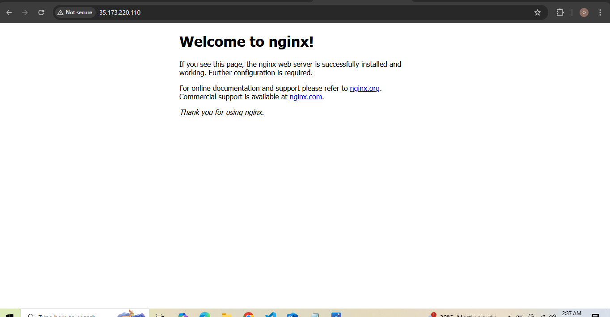

# Screenshots of the EC2 instance setup 

## add images here

# Commands used for installation and configuration.

To install NVM (curl -o- https://raw.githubusercontent.com/nvm-sh/nvm/v0.39.1/install.sh | bash)

then add this file docunment to load the NVM for use ( export NVM_DIR="$([ -z "${XDG_CONFIG_HOME-}" ] && printf %s "${HOME}/.nvm" || printf %s "${XDG_CONFIG_HOME}/nvm")"
[ -s "$NVM_DIR/nvm.sh" ] && \. "$NVM_DIR/nvm.sh" )

install npm ( nvm install --lts)
check if node is installed( node -v)
check if npm is installed (npm -v )

mkdir
cd into the Dir
install npm express ( npm i express )
sudo nano into you ( sudo nano app.js )
then edit this into it to configure your application(const express = require("express");
const app = express();
const port = 5000;

app.get("/", (reg, res) => {
  res.send("hey, I am running and the port is " + port);
});

app.listen(port, () => {
  console.log("Server is running on port " + port);
});       )

install npm2 ( npm i -g pm2 ) ; this will make your application run in background even when you close your tab
install nginx ( sudo apt install nginx )
to start nginx (sudo systemctl start nginx )
to check if nginx is running ( sudo systemctl status )

# add URL for running the application
http://35.173.220.110/
